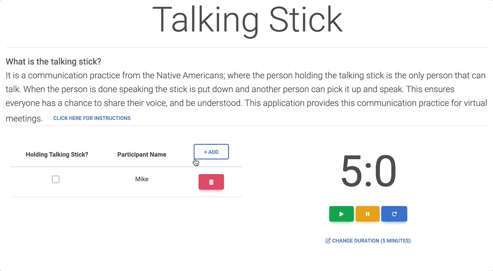

# talking-stick
**What is the talking stick?**

It is a communication practice from the Native Americans; where the person holding the talking stick is the only person 
that can talk. When the person is done speaking the stick is put down and another person can pick it up and speak. 
This ensures everyone has a chance to share their voice, and be understood. This application provides this communication
practice for virtual meetings.

# Demo


# Technologies Used
* ReactJS `18.x`
* mdb-react-ui-kit `5.x.x` (for ui design template)
* react-timer-hook (for the countdown timer)

# How to Run locally
First you need to clone or download the zip of this github repo
```
git clone https://github.com/maikerukun/talking-stick.git
```

Navigate into this repo's directory on your computer:
```
cd talking-stick
```

Install the app with `npm` (If you don't have npm, then [install nodejs here](https://nodejs.org/en/download/))
```
npm install
```

Now you can choose to run with npm or docker locally. Instructions below:

#### Run locally with NPM (best for development)
Run the app on your computer:
```
npm start
```
Now visit:

* http://localhost:3000/talking-stick
    * ^ This is the default since we set the homepage field in package.json. That `homepage` field is needed for gh-pages
      to work, so feel free to remove it if you want it. If you remove it, then default will be `http://localhost:3000/`
      
#### Run locally with Docker
First you need to have docker available on your machine. ([Install here](https://docs.docker.com/engine/install/) if need it)

** FYI the [Dockerfile](./Dockerfile) is at the root of this project

From the root of this project execute the docker build
```
docker build -t talking-stick:0.0.1 .
```

Now run the docker image you just created
```
docker run -p 3000:3000 talking-stick:0.0.1
```

Now visit:

* http://localhost:3000

